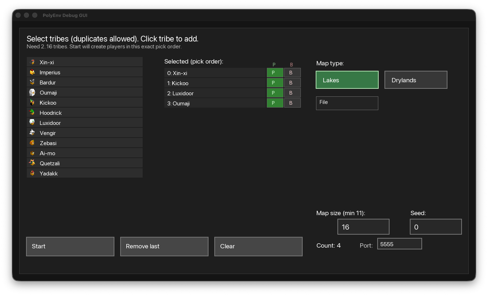
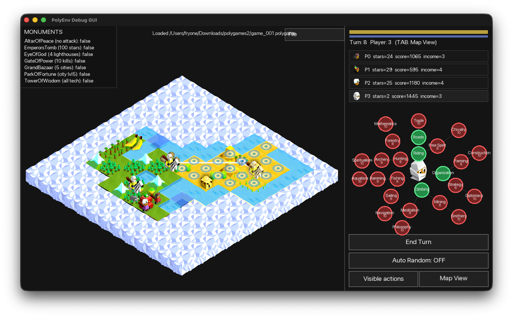
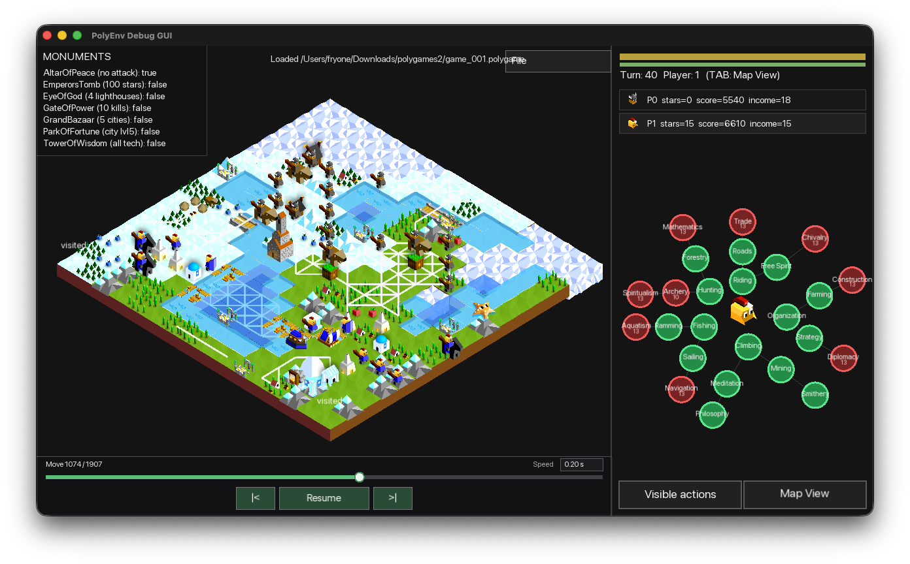

# GUI

The SFML GUI is a debugging and replay-inspection tool. It uses the same game
engine and replay format as Python.

## GUI Tour

### Game Setup

The start screen configures tribes and player order, human or bot control, map
type, map size, seed, and the bot server port.



### Manual Game And Debugging

The normal game view supports manual play and debugging. It shows the map,
player state, monument progress, technology tree, legal actions, and map-view
controls in one window.



### Replay Viewer

Loading a saved game opens the replay viewer. Its timeline and playback
controls can inspect any move while keeping the map, player state, technology
tree, and visible history available.



## Build And Run

```bash
git clone https://github.com/FryOne2137/PolyEnv.git
cd PolyEnv

cmake -S . -B build \
  -DGAME_ENGINE_BUILD_GUI=ON \
  -DGAME_ENGINE_BUILD_APPS=OFF \
  -DGAME_ENGINE_BUILD_PYTHON_BINDINGS=OFF

cmake --build build --target game_engine_gui -j
./build/game_engine_gui
```

Run the executable from the repository root so it can find `assets/` and
`data/Units.json`. Building requires CMake 3.20+ and a C++20-capable compiler.

## Save And View Replays

In a normal game, select `Save .polygame` from the File menu. Select
`Load .polygame` to open a replay viewer.

The viewer is read-only and provides a timeline, `Next move`, automatic replay,
an adjustable playback interval, `Map View`, and the visible-action history for
the player whose turn is shown at the selected point on the timeline. The event
history is also rewound when seeking to an earlier move. On macOS, load and save
use the system file picker. Windows uses the native file picker. On Linux, the
GUI uses Zenity or KDialog when either is available; otherwise it opens its own
path-entry dialog, so loading and saving remain available without an additional
desktop package.

Replay controls are arranged like a video player at the bottom-left of the map:
the timeline is above `Previous`, `Resume`/`Stop`, and `Next` controls. They stay
available while inspecting `Map View`.

## Game Rules In The GUI

The GUI shows legal actions from the engine. It blocks other actions while a
city reward is pending. A city or village can be captured only by an own unit
standing on it that has not moved or attacked this turn.
